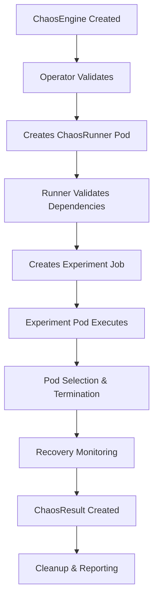

# Chaos Framework Command Execution Flow

## 🏗️ **Architecture Overview**

The chaos framework operates through a multi-layered architecture that translates natural language commands into actual Kubernetes chaos experiments.

```
┌─────────────────┐    ┌──────────────────┐    ┌─────────────────┐
│   User Input    │───▶│   Jarvis AI      │───▶│  Litmus Chaos   │
│ "Run chaos on   │    │   Engine         │    │   Operator      │
│  product-svc"   │    │                  │    │                 │
└─────────────────┘    └──────────────────┘    └─────────────────┘
                                │                        │
                                ▼                        ▼
┌─────────────────┐    ┌──────────────────┐    ┌─────────────────┐
│   Chaos         │◀───│   Kubernetes     │◀───│   Real Pod      │
│   Results       │    │   API Server     │    │   Disruption    │
│                 │    │                  │    │                 │
└─────────────────┘    └──────────────────┘    └─────────────────┘
```

---

## 🔄 **Command Execution Flow**

### **Phase 1: Natural Language Processing**

#### **1.1 User Command Input**
```bash
# Example commands
"Run chaos test on order-service"
"Execute pod failure with high intensity"
"Simulate network latency for user-service"
```

#### **1.2 NLP Engine Processing**
```java
// EnhancedNLPEngine.java
public ParsedCommand parseCommand(String command) {
    // 1. Multi-intent detection
    List<IntentType> intents = detectMultipleIntents(command);
    
    // 2. Service extraction
    List<String> services = extractMultipleServices(command);
    
    // 3. Test type extraction
    List<TestType> testTypes = extractMultipleTestTypes(command);
    
    // 4. Parameter extraction
    Map<String, Object> parameters = extractParameters(command);
    
    return ParsedCommand.builder()
        .intents(intents)
        .services(services)
        .testTypes(testTypes)
        .parameters(parameters)
        .build();
}
```

#### **1.3 Intent Classification**
```json
{
  "intent": "RUN_CHAOS_TEST",
  "confidence": 0.95,
  "entities": {
    "services": ["product-service"],
    "testTypes": ["POD_FAILURE"],
    "actions": ["run"]
  }
}
```

---

### **Phase 2: Context Analysis & Decision Making**

#### **2.1 Context Analysis**
```java
// ComprehensiveContextService.java
public ComprehensiveContext analyzeCommand(String command) {
    // 1. Parse command using enhanced NLP
    ParsedCommand parsed = enhancedNLPEngine.parseCommand(command);
    
    // 2. Identify dependencies and relationships
    DependencyGraph dependencies = dependencyAnalysisService.analyzeDependencies(
        testTypes, services, actions);
    
    // 3. Generate execution plan
    ExecutionPlan executionPlan = generateExecutionPlan(
        testTypes, services, actions, dependencies);
    
    // 4. Assess risks
    RiskAssessment riskAssessment = assessRisks(testTypes, services, actions);
    
    return ComprehensiveContext.builder()
        .parsedCommand(parsed)
        .executionPlan(executionPlan)
        .riskAssessment(riskAssessment)
        .build();
}
```

#### **2.2 Action Mapping**
```java
// IntelligentActionMapper.java
public ActionType mapToAction(IntentType intent, TestType testType) {
    switch (intent) {
        case RUN_TESTS:
            if (testType == TestType.CHAOS_TEST) {
                return ActionType.RUN_CHAOS_TESTS;
            }
            break;
        // ... other mappings
    }
}
```

---

### **Phase 3: Chaos Experiment Execution**

#### **3.1 ChaosExecutionService Processing**
```java
// ChaosExecutionService.java
public ExecutionResult executeChaosTest(String serviceName, Map<String, Object> parameters) {
    String chaosType = (String) parameters.getOrDefault("chaosType", "pod_failure");
    String intensity = (String) parameters.getOrDefault("intensity", "medium");
    String duration = (String) parameters.getOrDefault("duration", "60s");
    
    // Currently simulated - needs real kubectl execution
    Thread.sleep(5000); // Simulate experiment time
    
    return ExecutionResult.builder()
        .success(true)
        .message("Chaos test executed successfully")
        .data(Map.of(
            "service", serviceName,
            "chaosType", chaosType,
            "experimentStatus", "COMPLETED"
        ))
        .build();
}
```

#### **3.2 Real Kubernetes Integration (Target State)**
```java
// Future implementation needed
public ExecutionResult executeRealChaosTest(String serviceName, Map<String, Object> parameters) {
    // 1. Generate ChaosEngine YAML
    String chaosEngineYaml = generateChaosEngineYaml(serviceName, parameters);
    
    // 2. Apply to Kubernetes
    ProcessBuilder pb = new ProcessBuilder("kubectl", "apply", "-f", "-");
    Process process = pb.start();
    
    // 3. Monitor experiment execution
    return monitorChaosExperiment(serviceName);
}
```

---

### **Phase 4: Litmus Chaos Operator Processing**

#### **4.1 ChaosEngine Creation**
```yaml
# experiments/service/pod-failure.yaml
apiVersion: litmuschaos.io/v1alpha1
kind: ChaosEngine
metadata:
  name: pod-failure
  namespace: litmus
spec:
  appinfo:
    appns: 'microservices-product-service'
    applabel: 'app=product-service'
    appkind: 'deployment'
  chaosServiceAccount: k8s-chaos-admin
  experiments:
  - name: pod-delete
    spec:
      components:
        env:
        - name: TOTAL_CHAOS_DURATION
          value: '30'
        - name: TARGET_PODS
          value: ''
```

#### **4.2 Litmus Operator Workflow**


---

### **Phase 5: Real Pod Disruption Process**

#### **5.1 Pod Selection**
```bash
# Litmus operator queries Kubernetes API
kubectl get pods -n microservices-product-service \
  -l app=product-service \
  --field-selector=status.phase=Running
```

#### **5.2 Pod Termination**
```bash
# Chaos experiment pod executes
kubectl delete pod product-service-9879b496f-8mk68 \
  -n microservices-product-service \
  --grace-period=10
```

#### **5.3 Recovery Monitoring**
```bash
# Monitor pod recreation
kubectl get pods -n microservices-product-service \
  -l app=product-service \
  -w
```

---

### **Phase 6: Results & Monitoring**

#### **6.1 ChaosResult Generation**
```yaml
# kubectl get chaosresult pod-failure-pod-delete -n litmus -o yaml
apiVersion: litmuschaos.io/v1alpha1
kind: ChaosResult
metadata:
  name: pod-failure-pod-delete
  namespace: litmus
status:
  experimentStatus:
    phase: Completed
    verdict: Pass
    probeSuccessPercentage: 100
  history:
    passedRuns: 1
    failedRuns: 0
  targets:
  - name: product-service
    kind: deployment
    chaosStatus: targeted
```

#### **6.2 Real-time Monitoring**
```bash
# Monitor experiment progress
kubectl get chaosengines -n litmus -w
kubectl get chaosresults -n litmus -w

# Check pod status
kubectl get pods -n microservices-product-service -w
```

---

## 🔧 **Integration Points**

### **Jarvis AI → Kubernetes**
```java
// Current: Simulation
Thread.sleep(5000); // Simulate experiment

// Target: Real Execution
ProcessBuilder pb = new ProcessBuilder("kubectl", "apply", "-f", experimentYaml);
Process process = pb.start();
```

### **Kubernetes → Litmus Operator**
```yaml
# ChaosEngine CRD triggers operator
apiVersion: litmuschaos.io/v1alpha1
kind: ChaosEngine
spec:
  engineState: active  # Triggers operator action
```

### **Litmus Operator → Real Pods**
```bash
# Operator creates experiment pods that execute:
kubectl delete pod <target-pod> -n <namespace>
```

---

## 📊 **Data Flow Summary**

### **Input Flow**
1. **Natural Language** → NLP Engine → Parsed Intent
2. **Parsed Intent** → Context Analysis → Execution Plan
3. **Execution Plan** → Action Mapper → Chaos Parameters

### **Execution Flow**
4. **Chaos Parameters** → ChaosEngine YAML → Kubernetes API
5. **Kubernetes API** → Litmus Operator → Experiment Pod
6. **Experiment Pod** → Pod Termination → Real Disruption

### **Monitoring Flow**
7. **Real Disruption** → Recovery Monitoring → ChaosResult
8. **ChaosResult** → Jarvis AI → User Feedback

---

## 🎯 **Current vs. Target State**

| Component | Current State | Target State |
|-----------|---------------|--------------|
| **Command Processing** | ✅ Working | ✅ Working |
| **NLP Engine** | ✅ Working | ✅ Working |
| **Context Analysis** | ✅ Working | ✅ Working |
| **Chaos Execution** | ❌ Simulated | ✅ Real kubectl calls |
| **Pod Disruption** | ❌ Simulated | ✅ Real pod termination |
| **Monitoring** | ❌ Simulated | ✅ Real ChaosResults |
| **Recovery Tracking** | ❌ Simulated | ✅ Real pod recreation |

---

## 🚀 **Next Steps for Full Integration**

1. **Replace Simulation with Real Execution**
   ```java
   // Replace Thread.sleep() with actual kubectl commands
   ProcessBuilder pb = new ProcessBuilder("kubectl", "apply", "-f", yamlFile);
   ```

2. **Implement Real-time Monitoring**
   ```java
   // Monitor ChaosEngine and ChaosResult status
   kubectl get chaosengines -n litmus -o json
   kubectl get chaosresults -n litmus -o json
   ```

3. **Add Error Handling**
   ```java
   // Handle experiment failures and rollbacks
   if (chaosResult.getVerdict().equals("Fail")) {
       // Trigger rollback procedures
   }
   ```

4. **Enhance Reporting**
   ```java
   // Provide detailed experiment results
   return ExecutionResult.builder()
       .data(Map.of(
           "podsTerminated", actualPodCount,
           "recoveryTime", actualRecoveryTime,
           "systemImpact", actualImpactMetrics
       ))
       .build();
   ```

The framework is architecturally ready for full Kubernetes integration - it just needs the execution layer updated from simulation to real API calls.
